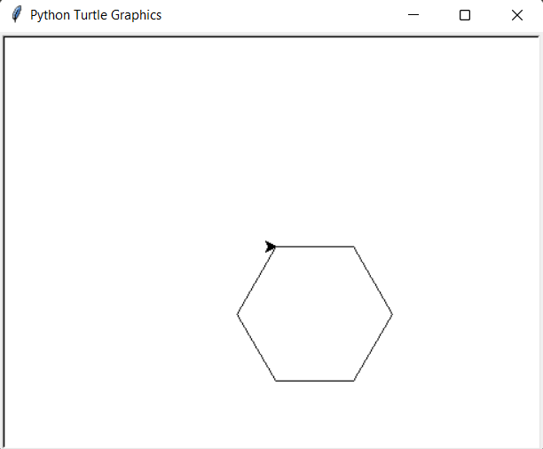
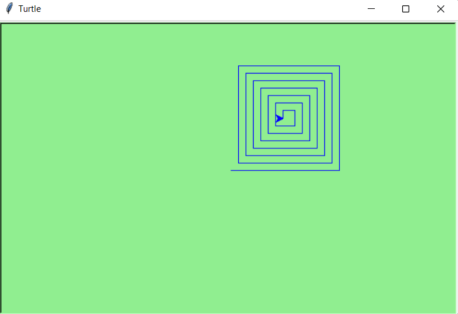
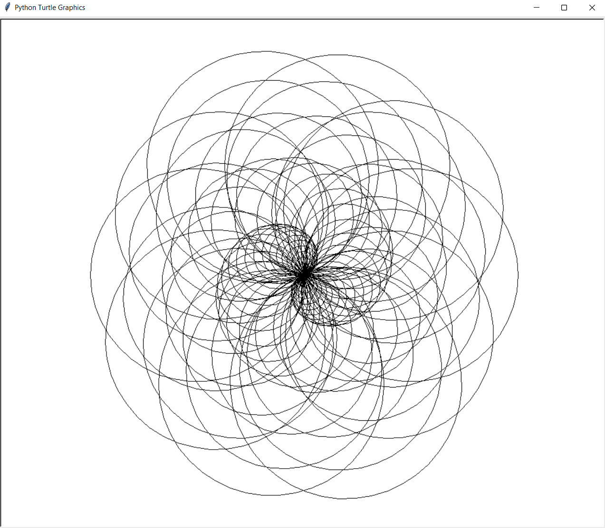
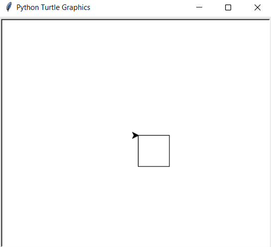
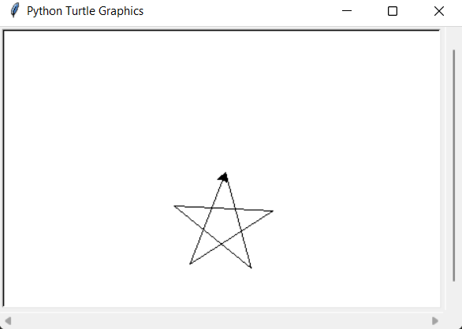

# Turtle Patterns
Programs to create patterns with Turtle in python.

## Getting Started
Read through our [Contribution Guidelines](CONTRIBUTING.md) before you contribute.

## Example programs

*Heart*

*Hexagon*

*Spiral Box*

*Spiral Helix*

*Square*

*Star*
